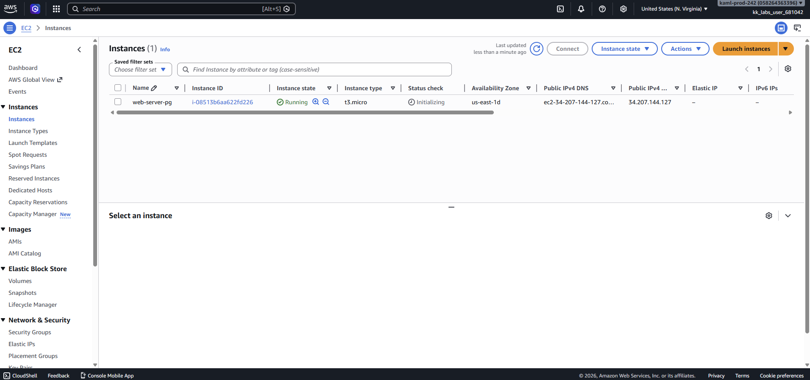
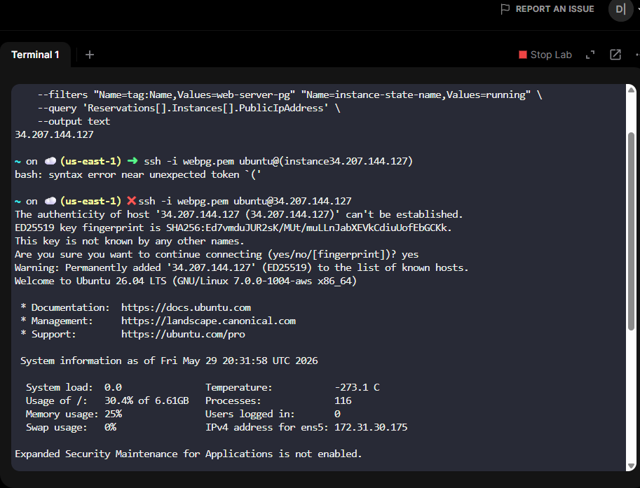

# AMAZON EC2

## Date

May 29, 2026

## Goal

Create an Amazon EC2 instance and successfully connect to it through the terminal using SSH.

## AWS Services Used

- Amazon EC2

## What I Did

- Launched a new EC2 instance.
- Selected the required configuration settings.
- Used a key pair for secure access.
- Located the instance's public IPv4 address.
- Connected to the instance using SSH from the terminal.

## What I Learned

- EC2 instances are virtual servers that run in AWS.
- A key pair is used to securely authenticate when connecting to an instance.
- Security groups control what traffic is allowed to and from an instance.
- SSH is used to remotely connect to Linux-based EC2 instances.
- The public IPv4 address is required to access an EC2 instance over the internet.

## Problems I Ran Into

I initially struggled with the SSH command syntax when connecting to the instance. I tried several variations of the command and received errors. To troubleshoot the issue, I reviewed the lab instructions, compared my command to the example provided, and carefully checked the file name and IP address I was using. After correcting the command format, I was able to successfully connect to the EC2 instance.

### Issue Breakdown

- **Problem Encountered:** SSH command would not connect to the instance.
- **Why It Happened:** Incorrect command formatting and syntax mistakes.
- **How I Investigated It:** Compared my command against the lab instructions and checked each part individually.
- **How I Solved It:** Corrected the SSH command and verified the key file and IP address were accurate.
- **What I Learned:** Small syntax errors can prevent successful connections, so carefully reviewing commands is an important troubleshooting skill.

## Commands Used

```bash
ssh -i <pem-file> ubuntu@<public-ip>
```


## Key Takeaways

- EC2 instances provide virtual servers in AWS.
- SSH allows secure remote access to Linux servers.
- Key pairs are essential for secure authentication.
- Careful attention to command syntax is important when troubleshooting.
- Security groups play a major role in controlling server access.

## Skills Practiced

- AWS EC2
- Linux Terminal
- SSH
- Troubleshooting
- Cloud Fundamentals

## Reflection

Today I learned how to launch and access an EC2 instance using AWS. 
The most challenging part was getting the SSH command formatted correctly, but troubleshooting the issue helped me better understand how remote connections work. 
Successfully connecting to the instance gave me confidence using both AWS and the Linux terminal.


## Screenshots




