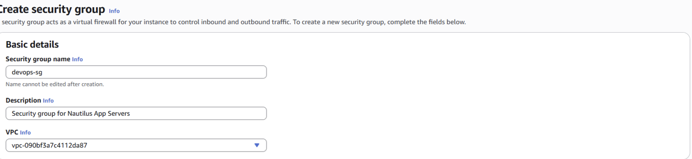
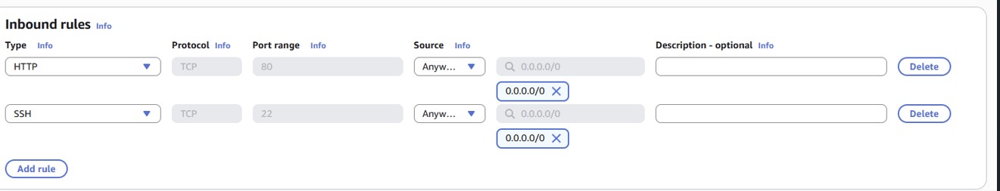

# AWS Security Group Lab

## Date

May 29, 2026

## Goal

Create a security group within the default VPC and configure inbound rules to allow HTTP and SSH traffic.

## AWS Services Used

* Amazon EC2
* Security Groups
* Default VPC

## What I Did

* Navigated to the AWS EC2 console.
* Opened the Security Groups section.
* Created a new security group named **devops-sg**.
* Added the description: **Security group for Nautilus App Servers**.
* Selected the default VPC.
* Added an inbound HTTP rule:

  * Port 80
  * Source: 0.0.0.0/0
* Added an inbound SSH rule:

  * Port 22
  * Source: 0.0.0.0/0
* Saved the security group configuration.

## What I Learned

* Security Groups act as virtual firewalls for AWS resources.
* Inbound rules control traffic entering an AWS resource.
* Outbound rules control traffic leaving an AWS resource.
* HTTP traffic uses port 80.
* SSH connections use port 22.

## Problems I Ran Into

I accidentally configured outbound rules instead of inbound rules when completing the lab.

### Issue Breakdown

* **Problem Encountered:** Added rules under the outbound section instead of the inbound section.
* **Why It Happened:** I was still learning the difference between inbound and outbound traffic.
* **How I Investigated It:** Reviewed the lab requirements and compared my configuration to the instructions.
* **How I Solved It:** Removed the incorrect outbound rules and recreated them under the inbound rules section.
* **What I Learned:** Inbound rules control incoming traffic to a server, while outbound rules control traffic leaving the server.

## Key Configuration

### Security Group Name

devops-sg

### Description

Security group for Nautilus App Servers

### Inbound Rules

| Type | Port | Source    |
| ---- | ---- | --------- |
| HTTP | 80   | 0.0.0.0/0 |
| SSH  | 22   | 0.0.0.0/0 |

## Commands Used

No terminal commands were required for this lab.

## Screenshots

### Security Group Configuration

### Inbound Rules Configured

## Key Takeaways

* Security Groups are stateful firewalls in AWS.
* Inbound and outbound rules serve different purposes.
* HTTP traffic requires port 80.
* SSH access requires port 22.
* Careful attention to configuration details is important when working with AWS networking.

## Skills Practiced

* AWS Security Groups
* AWS Networking
* Cloud Security
* Troubleshooting
* AWS Fundamentals

## Reflection

Today I learned how to create and configure a Security Group in AWS. The biggest challenge was understanding the difference between inbound and outbound rules. After reviewing the requirements and correcting my mistake, I gained a better understanding of how AWS controls network traffic and secures resources.
