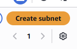
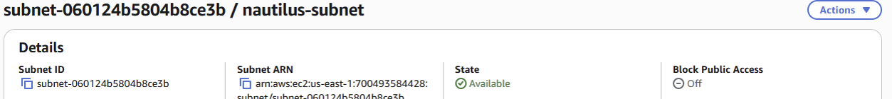

# AWS Subnet Lab

## Date

May 29, 2026

## Goal

Create a subnet named **nautilus-subnet** within the default VPC and gain a better understanding of CIDR blocks and IPv4 addressing.

## AWS Services Used

* Amazon VPC
* Subnets

## What I Did

* Navigated to the VPC Dashboard.
* Located the default VPC.
* Opened the Subnets section.
* Created a new subnet named **nautilus-subnet**.
* Selected an Availability Zone.
* Configured a subnet CIDR block.
* Saved and verified the subnet was successfully created.

## What I Learned

* A subnet is a smaller network segment within a VPC.
* Every subnet requires a unique CIDR block.
* CIDR blocks define the range of IP addresses available within a subnet.
* Subnets within the same VPC cannot have overlapping CIDR ranges.
* AWS automatically reserves some IP addresses within each subnet.

## Problems I Ran Into

I had difficulty understanding CIDR notation and selecting a valid IPv4 CIDR block for the subnet.

### Issue Breakdown

* **Problem Encountered:** Received errors when entering subnet CIDR ranges.
* **Why It Happened:** I was still learning how CIDR notation works and accidentally used overlapping IP ranges.
* **How I Investigated It:** Reviewed the existing VPC and subnet configurations and compared the CIDR ranges already in use.
* **How I Solved It:** Selected a valid CIDR block that did not overlap with any existing subnet ranges in the default VPC.
* **What I Learned:** Every subnet must have a unique CIDR block, and overlapping ranges are not allowed.

## Key Concepts

### VPC CIDR Block

The VPC has a larger IP address range that is divided into smaller subnet ranges.

### CIDR Notation

CIDR notation defines the available IP address range for a network.

Examples:

```text
10.0.0.0/16
10.0.1.0/24
172.31.0.0/20
```

### Subnet Requirements

* Must belong to a VPC.
* Must use a valid CIDR block.
* Cannot overlap with existing subnets.
* Must be created within a specific Availability Zone.

## Commands Used

No terminal commands were required for this lab.

## Screenshots

### Subnet Create



### Successful Subnet Creation



## Key Takeaways

* Subnets divide a VPC into smaller network segments.
* CIDR blocks determine available IP address ranges.
* Overlapping subnet ranges are not allowed.
* Understanding CIDR notation is important for AWS networking.
* Troubleshooting network configuration requires checking existing IP ranges before creating new resources.

## Skills Practiced

* Amazon VPC
* Subnet Configuration
* AWS Networking
* IPv4 Addressing
* CIDR Fundamentals
* Troubleshooting

## Reflection

Today I learned how to create a subnet within a VPC and gained exposure to CIDR notation and IPv4 addressing. The most challenging part was understanding why AWS rejected certain CIDR blocks, but troubleshooting the issue helped me understand that subnet ranges must be unique and cannot overlap with existing networks. This lab improved my understanding of AWS networking fundamentals.
