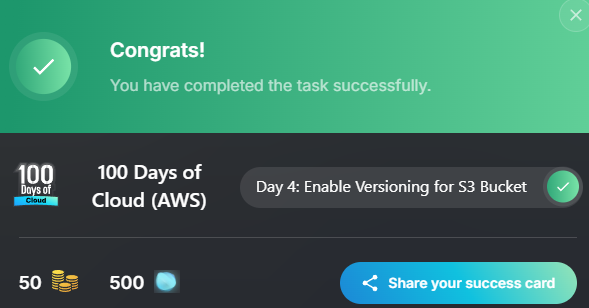

# AWS S3 Versioning Lab

## Date

May 30, 2026

## Goal

Enable versioning on an Amazon S3 bucket to protect data from accidental deletion, modification, or overwrites.

## AWS Services Used

* Amazon S3

## What I Did

* Navigated to the Amazon S3 console.
* Located the bucket **nautilus-s3-16139**.
* Opened the bucket properties.
* Found the Versioning settings section.
* Enabled bucket versioning.
* Saved the configuration changes.
* Verified that versioning was successfully enabled.

## What I Learned

* Versioning allows Amazon S3 to keep multiple versions of an object.
* Deleted or overwritten files can be recovered when versioning is enabled.
* Versioning improves data protection and recovery capabilities.
* Every new version of an object receives a unique version ID.
* Versioning is an important best practice for protecting critical data.

## Problems I Ran Into

I was initially unfamiliar with where versioning settings were located within the S3 bucket configuration.

### Issue Breakdown

* **Problem Encountered:** Locating the versioning settings for the bucket.
* **Why It Happened:** I was still learning the S3 console layout and bucket properties.
* **How I Investigated It:** Explored the bucket settings and reviewed the available configuration options.
* **How I Solved It:** Found the Versioning section under bucket properties and enabled it.
* **What I Learned:** Many S3 management features are configured through the bucket properties page.

## Key Configuration

### Bucket Name

nautilus-s3-16139

### Feature Enabled

Amazon S3 Versioning

### Purpose

Maintain multiple versions of objects to improve recovery from accidental deletion or modification.

## Commands Used

No terminal commands were required for this lab.

## Screenshots

## Key Takeaways

* Versioning provides protection against accidental data loss.
* Multiple versions of the same object can exist within a bucket.
* Deleted objects can be recovered when versioning is enabled.
* Version IDs help track object history.
* Versioning is a core S3 data protection feature.

## Skills Practiced

* Amazon S3
* Cloud Storage Management
* Data Protection
* AWS Console Navigation
* Cloud Fundamentals

## Reflection

Today I learned how to enable versioning on an Amazon S3 bucket. This lab helped me understand how AWS protects data by maintaining multiple versions of objects. I also learned that versioning is an important feature for backup, recovery, and protecting against accidental changes or deletions.
