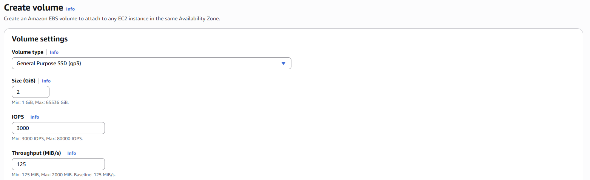
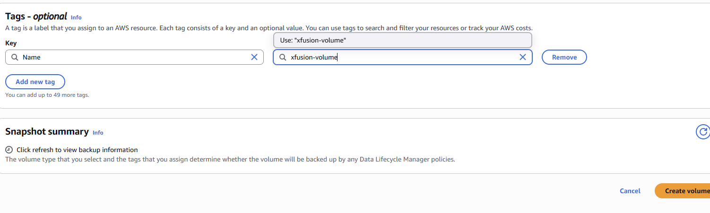
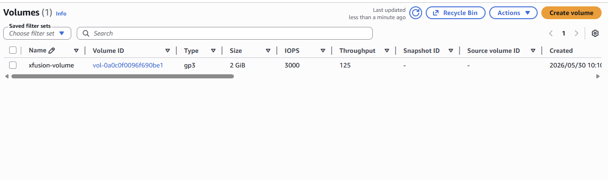

# Create GP3 Volume Lab

## Date

May 30, 2026

## Goal

Create a General Purpose SSD (gp3) EBS volume named **xfusion-volume** with a storage capacity of **2 GiB**.

## AWS Services Used

* Amazon EC2
* Amazon EBS (Elastic Block Store)

## What I Did

* Opened the EC2 Dashboard.
* Navigated to the Volumes section under Elastic Block Store (EBS).
* Selected **Create Volume**.
* Entered the volume name **xfusion-volume**.
* Selected **gp3** as the volume type.
* Set the volume size to **2 GiB**.
* Chose an Availability Zone.
* Created and verified the volume.

## What I Learned

* Amazon EBS provides persistent block storage for EC2 instances.
* gp3 volumes are General Purpose SSD volumes.
* EBS volumes can be created independently and attached to EC2 instances later.
* Storage resources can be customized based on workload requirements.
* Volume size is measured in GiB.

## Problems I Ran Into

I was initially unfamiliar with the different EBS volume types and their use cases.

### Issue Breakdown

* **Problem Encountered:** Understanding which volume type to use.
* **Why It Happened:** I was new to Amazon EBS storage options.
* **How I Investigated It:** Reviewed the lab requirements and available volume types.
* **How I Solved It:** Confirmed that gp3 was the required volume type and completed the configuration.
* **What I Learned:** gp3 is a commonly used SSD storage option that provides good performance and flexibility.

## Key Configuration

### Volume Name

xfusion-volume

### Volume Type

gp3

### Volume Size

2 GiB

## Commands Used

No terminal commands were required for this lab.

## Screenshots

### Volume Configuration

### Successful Volume Creation

## Key Takeaways

* Amazon EBS provides persistent storage for AWS workloads.
* gp3 is a General Purpose SSD volume type.
* EBS volumes can be attached and detached from EC2 instances.
* Understanding AWS storage services is important for cloud infrastructure management.
* Storage resources should be configured based on workload needs.

## Skills Practiced

* Amazon EBS
* AWS Storage
* Cloud Infrastructure
* AWS Fundamentals
* Resource Configuration

## Reflection

Today I learned how to create an Amazon EBS volume using the gp3 storage type. This lab introduced me to AWS block storage and helped me understand how storage resources are provisioned and managed in the cloud. I also gained hands-on experience configuring storage settings and creating an EBS volume.
