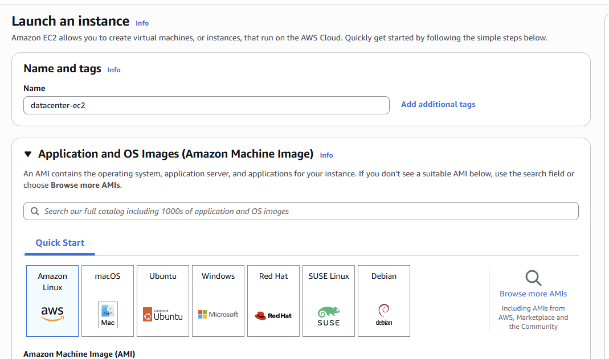
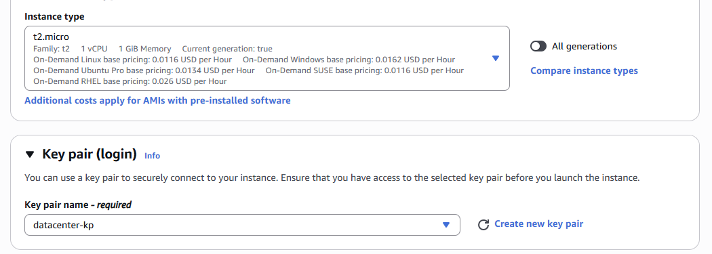

# Launch EC2 Instance Lab

## Date

May 30, 2026

## Goal

Launch an Amazon EC2 instance named **datacenter-ec2** using the Amazon Linux AMI, create a new RSA key pair, and verify that the instance is running successfully.

## AWS Services Used

* Amazon EC2
* Key Pairs
* Security Groups

## What I Did

* Opened the EC2 Dashboard.
* Selected **Launch Instance**.
* Named the instance **datacenter-ec2**.
* Selected the Amazon Linux AMI.
* Chose the **t2.micro** instance type.
* Created a new RSA key pair named **datacenter-kp**.
* Attached the default security group.
* Launched the instance.
* Verified the instance entered the **Running** state.

## What I Learned

* EC2 instances take time to transition from launching to running.
* A key pair is required for secure access to an EC2 instance.
* The Amazon Linux AMI provides a ready-to-use Linux operating system.
* Instance types determine the resources available to a virtual server.
* The default security group can be attached during instance creation.

## Problems I Ran Into

I initially thought I had configured the instance incorrectly because the lab reported that the EC2 instance was not running.

### Issue Breakdown

* **Problem Encountered:** The task validation failed because the EC2 instance was not in a running state.
* **Why It Happened:** The instance was still starting up and had not fully transitioned to the Running state.
* **How I Investigated It:** Checked the EC2 dashboard and reviewed the instance status.
* **How I Solved It:** Waited for the instance initialization process to complete and confirmed the state changed to Running.
* **What I Learned:** AWS resources may require time to provision, and it's important to verify the resource status before assuming something is wrong.

## Key Configuration

### Instance Name

datacenter-ec2

### AMI

Amazon Linux

### Instance Type

t2.micro

### Key Pair

datacenter-kp

### Security Group

Default Security Group

## Commands Used

No terminal commands were required for this lab.

## Screenshots

### EC2 Instance Configuration

### Instance Running Successfully

## Key Takeaways

* EC2 instances are virtual servers hosted in AWS.
* AWS resources often require provisioning time before becoming available.
* Key pairs provide secure authentication for EC2 access.
* The Amazon Linux AMI is commonly used for AWS workloads.
* Always verify the instance state before troubleshooting further.

## Skills Practiced

* Amazon EC2
* AWS Compute Services
* Key Pair Management
* Cloud Infrastructure
* Troubleshooting
* AWS Fundamentals

## Reflection

Today I learned how to launch an Amazon EC2 instance from start to finish. The biggest challenge was understanding that AWS resources need time to provision before becoming available. After verifying the instance status and waiting for it to finish starting up, I successfully completed the lab and gained more confidence working with EC2.
