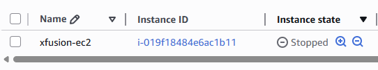
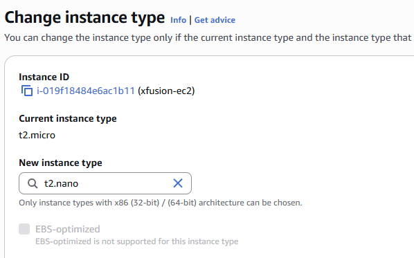
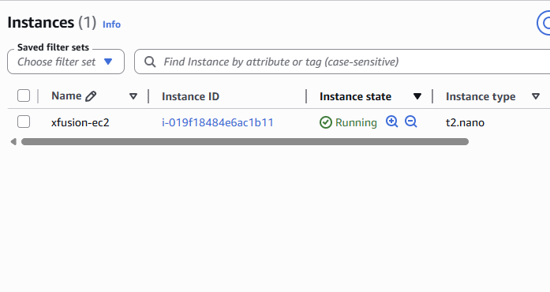

# Change EC2 Instance Type Lab

## Date

May 30, 2026

## Goal

Modify the EC2 instance **xfusion-ec2** by changing its instance type from **t2.micro** to **t2.nano** and ensure the instance returns to a running state.

## AWS Services Used

* Amazon EC2

## What I Did

* Opened the EC2 Dashboard.
* Located the **xfusion-ec2** instance.
* Verified the instance status checks were complete.
* Stopped the instance.
* Modified the instance type from **t2.micro** to **t2.nano**.
* Started the instance again.
* Verified the instance returned to the **Running** state.
* Confirmed the instance type change was successful.

## What I Learned

* Some EC2 configuration changes require the instance to be stopped first.
* Instance types determine the CPU and memory resources available to an EC2 instance.
* AWS does not allow instance type modifications while an instance is running.
* Status checks should be completed before making changes to an EC2 instance.
* After modifying an instance type, the instance must be started again.

## Problems I Ran Into

I initially struggled to find where to change the instance type and did not realize the instance had to be stopped before the modification could be made.

### Issue Breakdown

* **Problem Encountered:** Unable to change the EC2 instance type.
* **Why It Happened:** I was unfamiliar with the process for modifying EC2 instance configurations.
* **How I Investigated It:** Explored the EC2 instance actions menu and reviewed the available options.
* **How I Solved It:** Learned that the instance must first be stopped, then the instance type can be modified before restarting it.
* **What I Learned:** Some EC2 settings can only be changed while the instance is in a stopped state.

## Key Configuration

### Instance Name

xfusion-ec2

### Original Instance Type

t2.micro

### New Instance Type

t2.nano

### Final State

Running

## Commands Used

No terminal commands were required for this lab.

## Screenshots

### Original Instance Configuration

### Instance Type Modification

### Instance Running After Change

## Key Takeaways

* EC2 instances must often be stopped before modifying hardware-related settings.
* Instance types can be changed to better match workload requirements.
* AWS status checks should be verified before making changes.
* Understanding instance lifecycle states is important when managing EC2 resources.
* Proper resource sizing helps optimize cloud costs and performance.

## Skills Practiced

* Amazon EC2
* Instance Management
* Cloud Resource Optimization
* AWS Fundamentals
* Troubleshooting

## Reflection

Today I learned how to modify the instance type of an existing EC2 instance. The most challenging part was figuring out why the option was unavailable, but I discovered that the instance needed to be stopped first. This lab helped me better understand the EC2 lifecycle and how AWS resources can be resized to meet changing requirements.
