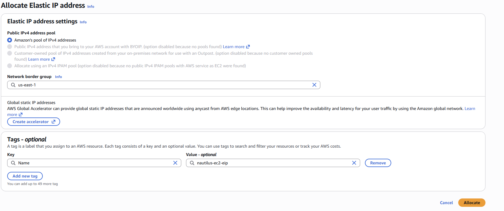
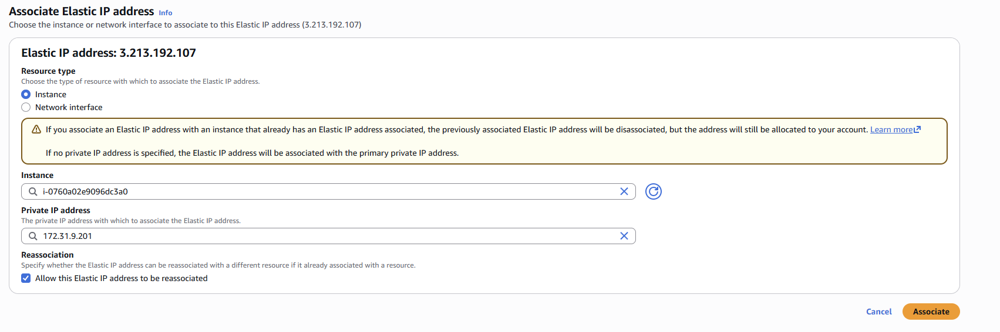

# Attach Elastic IP Lab

## Date

May 30, 2026

## Goal

Attach the Elastic IP address **nautilus-ec2-eip** to the EC2 instance **nautilus-ec2** in the **us-east-1** region.

## AWS Services Used

* Amazon EC2
* Elastic IP

## What I Did

* Opened the EC2 Dashboard.
* Located the Elastic IP section.
* Found the Elastic IP address **nautilus-ec2-eip**.
* Reviewed the Elastic IP configuration.
* Associated the Elastic IP address with the **nautilus-ec2** instance.
* Verified the Elastic IP was successfully attached to the instance.

## What I Learned

* An Elastic IP is a static public IPv4 address provided by AWS.
* Elastic IPs can be associated with EC2 instances.
* Elastic IPs help maintain a consistent public IP address even if an instance is restarted.
* Elastic IP addresses must be associated with a resource before they can be used.
* AWS networking services help provide reliable external connectivity.

## Problems I Ran Into

I initially struggled to understand how Elastic IPs worked and assumed I needed to create or allocate a new Elastic IP address before attaching it to the instance.

### Issue Breakdown

* **Problem Encountered:** Difficulty finding how to attach the Elastic IP to the EC2 instance.
* **Why It Happened:** I was unfamiliar with the Elastic IP workflow and management interface.
* **How I Investigated It:** Explored the EC2 networking options and reviewed the available Elastic IP actions.
* **How I Solved It:** Learned how Elastic IPs are managed and successfully associated the existing Elastic IP with the EC2 instance.
* **What I Learned:** Elastic IPs are static public IP addresses that can be attached to EC2 instances for consistent network access.

## Key Configuration

### Instance Name

nautilus-ec2

### Elastic IP

nautilus-ec2-eip

### Region

us-east-1

### Action Performed

Associated Elastic IP with EC2 Instance

## Commands Used

No terminal commands were required for this lab.

## Screenshots

### Elastic IP Configuration

### Elastic IP Associated with Instance

## Key Takeaways

* Elastic IPs provide static public IP addresses in AWS.
* Elastic IPs can be reassigned to different instances if needed.
* Associating an Elastic IP allows consistent external access to resources.
* AWS networking services are an important part of cloud infrastructure.
* Understanding IP management is essential for cloud engineers.

## Skills Practiced

* Amazon EC2
* Elastic IP Management
* AWS Networking
* Cloud Infrastructure
* Troubleshooting

## Reflection

Today I learned how to associate an Elastic IP address with an EC2 instance. The most challenging part was understanding how Elastic IPs are managed and attached to resources. After exploring the networking options and completing the association, I gained a better understanding of AWS networking and public IP management.
