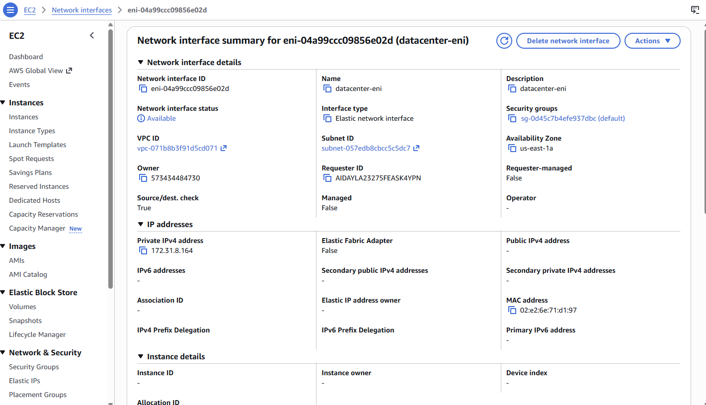
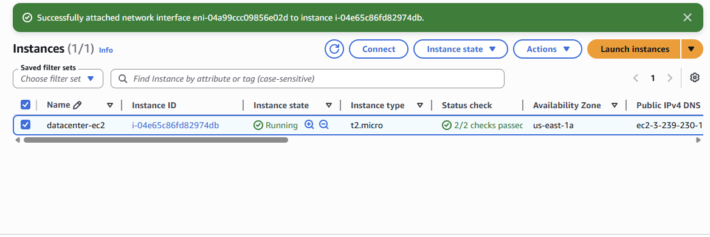

# Attach Elastic Network Interface Lab

## Date

May 30, 2026

## Goal

Attach the Elastic Network Interface (ENI) **datacenter-eni** to the EC2 instance **datacenter-ec2** and verify that the interface is successfully attached.

## AWS Services Used

* Amazon EC2
* Elastic Network Interface (ENI)

## What I Did

* Opened the EC2 Dashboard.
* Verified the **datacenter-ec2** instance was fully initialized.
* Navigated to the **Network Interfaces** section.
* Located the network interface **datacenter-eni**.
* Selected the **Attach** action.
* Chose the **datacenter-ec2** instance.
* Attached the network interface.
* Verified the interface status changed to **Attached**.

## What I Learned

* An Elastic Network Interface (ENI) is a virtual network card in AWS.
* ENIs can be attached and detached from EC2 instances.
* Network interfaces provide networking capabilities such as private IP addresses and security groups.
* AWS allows multiple network interfaces to be attached to an instance depending on the instance type.
* It is important to verify the attachment status before considering the task complete.

## Problems I Ran Into

I initially had trouble locating the Elastic Network Interface because I was looking through the EC2 instance details rather than the dedicated Network Interfaces section.

### Issue Breakdown

* **Problem Encountered:** Could not find the Elastic Network Interface.
* **Why It Happened:** I was unfamiliar with where AWS manages ENIs in the console.
* **How I Investigated It:** Explored the EC2 dashboard and reviewed the networking-related sections.
* **How I Solved It:** Located the **Network Interfaces** section under EC2 and attached the existing ENI from there.
* **What I Learned:** AWS networking resources are managed separately from EC2 instance details and may require navigating to dedicated networking sections.

## Key Configuration

### Instance Name

datacenter-ec2

### Network Interface

datacenter-eni

### Region

us-east-1

### Final Status

Attached

## Commands Used

No terminal commands were required for this lab.

## Screenshots

### Network Interface Details

### ENI Attached to Instance

## Key Takeaways

* ENIs function as virtual network adapters in AWS.
* Network Interfaces can be attached to EC2 instances to provide additional networking capabilities.
* AWS networking resources are managed separately from instance configuration.
* Verifying resource status is an important troubleshooting step.
* Understanding AWS networking components is essential for cloud infrastructure management.

## Skills Practiced

* Amazon EC2
* Elastic Network Interfaces
* AWS Networking
* Cloud Infrastructure
* Troubleshooting

## Reflection

Today I learned how to attach an Elastic Network Interface to an EC2 instance. The biggest challenge was figuring out where AWS manages network interfaces within the console. After locating the correct section and successfully attaching the ENI, I gained a better understanding of AWS networking resources and how they interact with EC2 instances.
