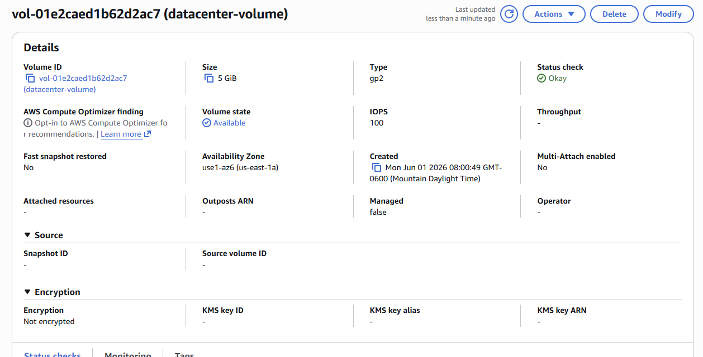
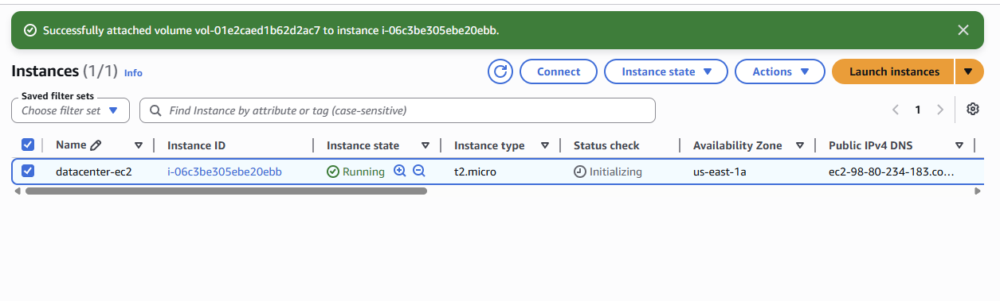

# Attach EBS Volume Lab

## Date

May 30, 2026

## Goal

Attach the existing EBS volume **datacenter-volume** to the EC2 instance **datacenter-ec2** using the device name **/dev/sdb**.

## AWS Services Used

* Amazon EC2
* Amazon EBS (Elastic Block Store)

## What I Did

* Opened the EC2 Dashboard.
* Navigated to the **Volumes** section under Elastic Block Store (EBS).
* Located the volume **datacenter-volume**.
* Selected the **Attach Volume** action.
* Chose the EC2 instance **datacenter-ec2**.
* Set the device name to **/dev/sdb**.
* Attached the volume.
* Verified the volume status showed **In-use** after attachment.

## What I Learned

* EBS volumes provide persistent block storage for EC2 instances.
* Volumes can be attached and detached from EC2 instances.
* Device names determine how attached storage is identified by the operating system.
* Attached volumes can be used to expand storage capacity.
* EBS volumes and EC2 instances must be in the same Availability Zone.

## Problems I Ran Into

I was initially unsure where to attach the volume and what the device name represented.

### Issue Breakdown

* **Problem Encountered:** Understanding how to attach an existing EBS volume to an EC2 instance.
* **Why It Happened:** I was new to EBS volume management and device naming conventions.
* **How I Investigated It:** Explored the EC2 and EBS sections and reviewed the volume attachment options.
* **How I Solved It:** Located the Attach Volume action, selected the correct instance, and specified **/dev/sdb** as required.
* **What I Learned:** Device names help the operating system identify attached storage devices, and AWS allows these names to be configured during attachment.

## Key Configuration

### Instance Name

datacenter-ec2

### Volume Name

datacenter-volume

### Device Name

/dev/sdb

### Final Status

In-use

## Commands Used

No terminal commands were required for this lab.

## Screenshots

### Volume Details

### Volume Successfully Attached

## Key Takeaways

* EBS volumes provide persistent storage independent of EC2 instances.
* Volumes can be attached to existing instances to increase storage capacity.
* Device names are important when attaching storage devices.
* EBS volume status changes from **Available** to **In-use** when attached.
* Understanding AWS storage services is an important cloud engineering skill.

## Skills Practiced

* Amazon EBS
* Amazon EC2
* AWS Storage Management
* Cloud Infrastructure
* Resource Configuration

## Reflection

Today I learned how to attach an existing EBS volume to an EC2 instance. This lab helped me understand how AWS manages block storage and how additional storage can be connected to running infrastructure. I also learned the importance of device names and verifying that the volume attachment was successful.
